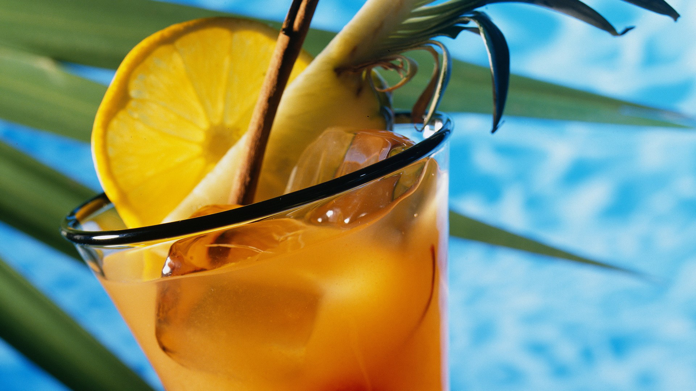
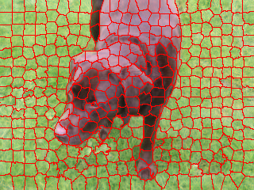

# parallel-SLIC-superpixels
parallel SLIC-superpixels algorithm. C++, OpenCV, OpenMP, CUDA

| Image                              | SLIC                                                     | Parallel-SLIC                                                |
| ---------------------------------- | -------------------------------------------------------- | ------------------------------------------------------------ |
|  |  |  |
|   |   |  |


##### Run the code

Compiler

```c++
pkg-config --cflags opencv` -o test_slic test_slic.cpp slic.cpp `pkg-config --libs opencv
```

Running

```c++
./test_slic dog.png 400 40 dog_segmentation.png
```

